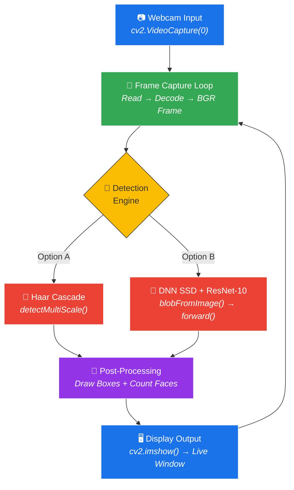
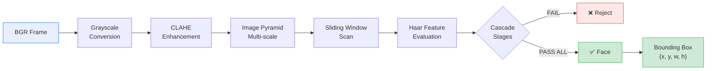
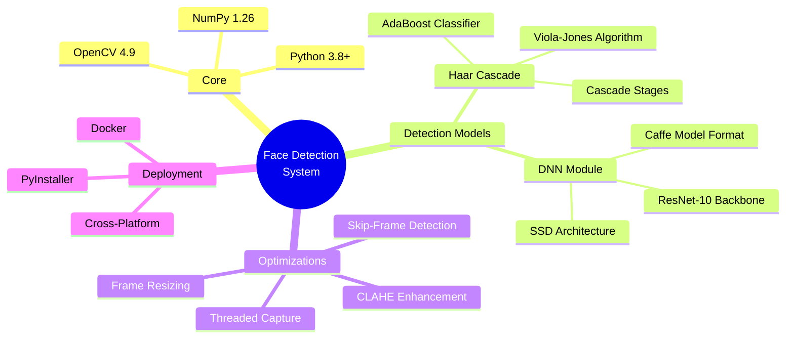
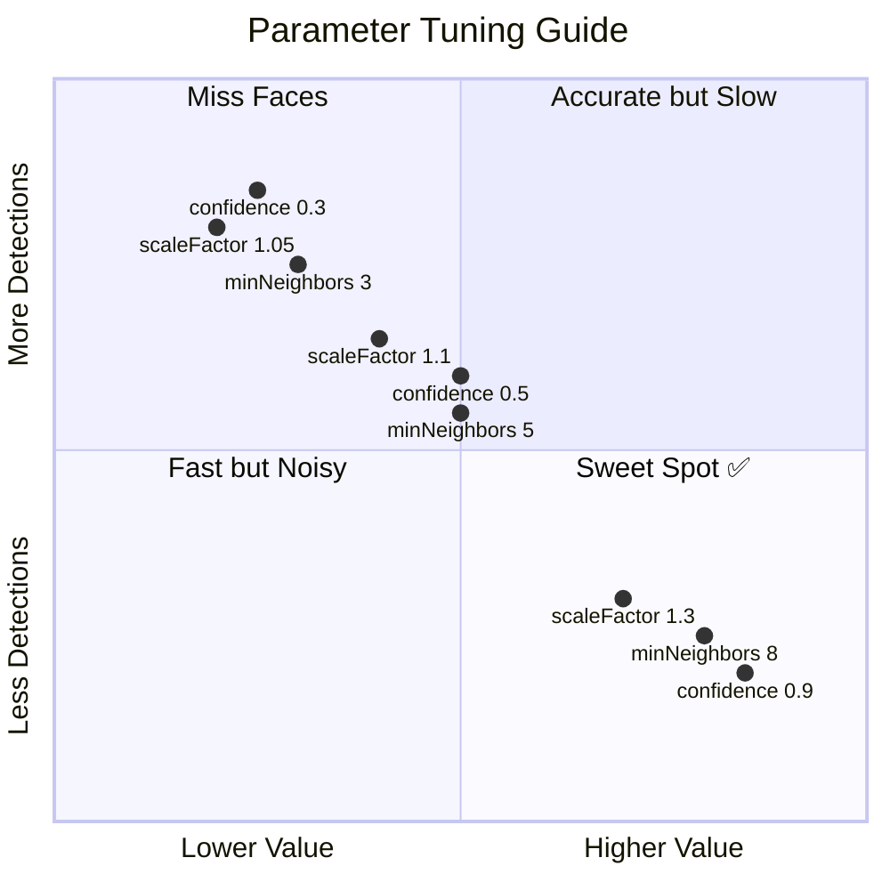
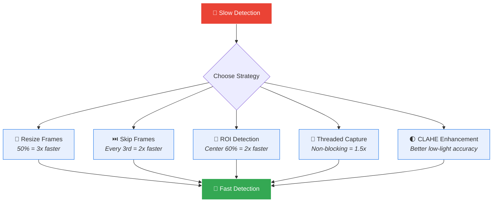
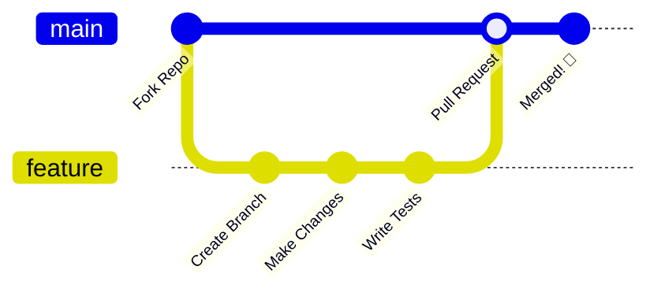

<p align="center">
  
</p>

<h1 align="center">🎯 Real-Time Face Detection System</h1>

<p align="center">
  <strong>Detect • Track • Count — Human faces in real-time using your webcam</strong>
</p>

<p align="center">
  <a href="#-features"></a>
  <a href="#-quick-start"></a>
  <a href="./docs/"></a>
  <a href="./LICENSE"></a>
</p>

<p align="center">
  
  
  
  
  
  
</p>

---

## 📸 Preview

```
╔══════════════════════════════════════════════════════════╗
║  Faces Detected: 3                         FPS: 30.2    ║
║  ┌──────────┐   ┌──────────┐   ┌──────────┐            ║
║  │  ┌────┐  │   │  ┌────┐  │   │  ┌────┐  │            ║
║  │  │ 😊 │  │   │  │ 😊 │  │   │  │ 😊 │  │            ║
║  │  └────┘  │   │  └────┘  │   │  └────┘  │            ║
║  │  98.7%   │   │  95.2%   │   │  91.4%   │            ║
║  └──────────┘   └──────────┘   └──────────┘            ║
║                                                         ║
║                    [Press Q to Quit]                     ║
╚══════════════════════════════════════════════════════════╝
```

---

## ✨ Features

<table>
  <tr>
    <td align="center" width="33%">
      <h3>📹 Live Video Capture</h3>
      <p>Real-time webcam feed with smooth frame rendering at 30+ FPS</p>
    </td>
    <td align="center" width="33%">
      <h3>🔍 Face Detection</h3>
      <p>Dual engine: Haar Cascade (fast) & DNN SSD-ResNet (accurate)</p>
    </td>
    <td align="center" width="33%">
      <h3>📊 Face Counting</h3>
      <p>Live on-screen counter showing total detected faces</p>
    </td>
  </tr>
  <tr>
    <td align="center" width="33%">
      <h3>🟢 Bounding Boxes</h3>
      <p>Color-coded rectangles with confidence scores around each face</p>
    </td>
    <td align="center" width="33%">
      <h3>⚡ FPS Counter</h3>
      <p>Real-time performance monitor overlay on video feed</p>
    </td>
    <td align="center" width="33%">
      <h3>🎨 Clean UI Overlay</h3>
      <p>Semi-transparent HUD with stats, labels, and smooth rendering</p>
    </td>
  </tr>
</table>

---

## 🏗️ System Architecture



---

## 🔬 Detection Pipeline — Haar Cascade



---

## 🔬 Detection Pipeline — DNN (SSD + ResNet)


---

## 📊 Performance Comparison

### Haar Cascade vs DNN

```mermaid
xychart-beta
    title "Detection Accuracy by Scenario (%)"
    x-axis ["Frontal Face", "Side Profile", "Low Light", "Multiple Faces", "Tilted Face", "Small Face"]
    y-axis "Accuracy (%)" 0 --> 100
    bar [95, 40, 55, 80, 30, 60]
    bar [98, 85, 90, 95, 80, 88]
```



> 🔵 **Blue** = Haar Cascade &nbsp;&nbsp; 🟢 **Green** = DNN (SSD + ResNet)

### FPS Benchmarks

| Configuration | Haar Cascade | DNN (CPU) | DNN (GPU) |
|:---|:---:|:---:|:---:|
| 640×480 (Full) | **30 FPS** | **25 FPS** | **60+ FPS** |
| 320×240 (Half) | **60+ FPS** | **45 FPS** | **60+ FPS** |
| Skip Frames (3) | **90+ FPS** | **70 FPS** | **60+ FPS** |
| With CLAHE | **28 FPS** | **23 FPS** | **55+ FPS** |

---

## 🛠️ Tech Stack



---

## 🚀 Quick Start

### Prerequisites

| Requirement | Minimum | Recommended |
|:---|:---:|:---:|
| **Python** | 3.8 | 3.10+ |
| **Webcam** | USB/Built-in | Any |
| **RAM** | 2 GB | 4 GB+ |
| **OS** | Win/Mac/Linux | Any |

### Installation

```bash
# 1. Clone the repository
git clone https://github.com/algorithmicmind/face_detect_bot.git
cd face_detect_bot

# 2. Create virtual environment
python -m venv venv

# 3. Activate virtual environment
# Windows:
venv\Scripts\activate
# macOS/Linux:
source venv/bin/activate

# 4. Install dependencies
pip install -r requirements.txt
```

### Run

```bash
# 🟢 Haar Cascade (fast, lightweight)
python src/face_detector_haar.py

# 🔵 DNN - SSD + ResNet (more accurate)
python src/face_detector_dnn.py
```

### Controls

| Key | Action |
|:---:|:---|
| `Q` | Quit the application |

---

## 📂 Project Structure

```
face_detect_bot/
│
├── 📁 src/                           # Source code
│   ├── face_detector_haar.py         # Haar Cascade implementation
│   ├── face_detector_dnn.py          # DNN-based implementation
│   └── utils.py                      # Shared utilities (FPS, drawing, camera)
│
├── 📁 models/                        # Pre-trained model files
│   ├── haarcascade_frontalface_default.xml
│   ├── deploy.prototxt               # DNN architecture definition
│   └── res10_300x300_ssd_iter_140000.caffemodel
│
├── 📁 docs/                          # 📖 Comprehensive documentation
│   ├── 01_project_overview.md        # Project summary & architecture
│   ├── 02_environment_setup.md       # Setup & installation guide
│   ├── 03_understanding_opencv.md    # OpenCV core concepts
│   ├── 04_haar_cascade_guide.md      # Haar algorithm deep dive
│   ├── 05_dnn_detection_guide.md     # DNN detection explained
│   ├── 06_implementation.md          # Step-by-step code walkthrough
│   ├── 07_testing_debugging.md       # Testing & troubleshooting
│   ├── 08_optimization.md            # Performance tuning
│   └── 09_deployment_guide.md        # Packaging & deployment
│
├── requirements.txt                  # Python dependencies
├── README.md                         # ← You are here
├── LICENSE                           # Apache 2.0 License
└── .gitignore                        # Git ignore rules
```

---

## 📖 Documentation Index

> 9 detailed guides covering everything from setup to deployment


| # | Document | Description |
|:---:|:---|:---|
| 01 | [Project Overview](./docs/01_project_overview.md) | Features, architecture diagram, tech stack summary |
| 02 | [Environment Setup](./docs/02_environment_setup.md) | Python, venv, OpenCV, webcam verification |
| 03 | [Understanding OpenCV](./docs/03_understanding_opencv.md) | Core functions: VideoCapture, cvtColor, rectangle, putText |
| 04 | [Haar Cascade Guide](./docs/04_haar_cascade_guide.md) | Viola-Jones algorithm, integral images, AdaBoost, tuning |
| 05 | [DNN Detection Guide](./docs/05_dnn_detection_guide.md) | SSD + ResNet-10, blob preprocessing, inference pipeline |
| 06 | [Implementation](./docs/06_implementation.md) | Complete code walkthrough for both detectors + utils |
| 07 | [Testing & Debugging](./docs/07_testing_debugging.md) | Component tests, common errors, debugging strategies |
| 08 | [Optimization](./docs/08_optimization.md) | Frame resize, CLAHE, threaded capture, skip-frame |
| 09 | [Deployment Guide](./docs/09_deployment_guide.md) | PyInstaller, Docker, cross-platform, packaging |

---

## 🔧 Configuration Options

### Haar Cascade Parameters

```python
faces = face_cascade.detectMultiScale(
    gray,
    scaleFactor=1.1,      # 🔧 Image pyramid scale (1.05–1.3)
    minNeighbors=5,       # 🔧 Detection strictness (3–8)
    minSize=(30, 30),     # 🔧 Minimum face size in pixels
    maxSize=(300, 300)    # 🔧 Maximum face size in pixels
)
```

### DNN Confidence Threshold

```python
CONFIDENCE_THRESHOLD = 0.5   # 🔧 Range: 0.3 (lenient) → 0.9 (strict)
```

### Tuning Quick Reference



---

## ⚡ Optimization Strategies



---

## 🧪 Testing

```bash
# Test webcam access
python -c "import cv2; cap=cv2.VideoCapture(0); print('✅ Webcam OK' if cap.isOpened() else '❌ Webcam Failed'); cap.release()"

# Test OpenCV installation
python -c "import cv2; print(f'✅ OpenCV {cv2.__version__}')"

# Test Haar Cascade loading
python -c "import cv2; c=cv2.CascadeClassifier(cv2.data.haarcascades+'haarcascade_frontalface_default.xml'); print('✅ Haar OK' if not c.empty() else '❌ Failed')"
```

---

## 🤝 Contributing

Contributions are welcome! Here's how:



1. **Fork** the repository
2. **Create** a feature branch (`git checkout -b feature/amazing-feature`)
3. **Commit** your changes (`git commit -m 'Add amazing feature'`)
4. **Push** to the branch (`git push origin feature/amazing-feature`)
5. **Open** a Pull Request

---

## 📜 License

This project is licensed under the **Apache License 2.0** — see the [LICENSE](./LICENSE) file for details.

---

## 🙏 Acknowledgments

- **[OpenCV](https://opencv.org/)** — Open Source Computer Vision Library
- **[Viola & Jones](https://www.cs.cmu.edu/~efros/courses/LBMV07/Papers/viola-IJCV-01.pdf)** — Original Haar Cascade paper (2001)
- **[SSD: Single Shot MultiBox Detector](https://arxiv.org/abs/1512.02325)** — DNN architecture reference
- **[OpenCV DNN Samples](https://github.com/opencv/opencv/tree/master/samples/dnn)** — Pre-trained model files

---

<p align="center">
  <b>Built with ❤️ by <a href="https://github.com/algorithmicmind">AlgorithmicMind</a></b>
</p>

<p align="center">
  
  
</p>

<p align="center">
  ⭐ If you found this project helpful, please give it a star!
</p>
